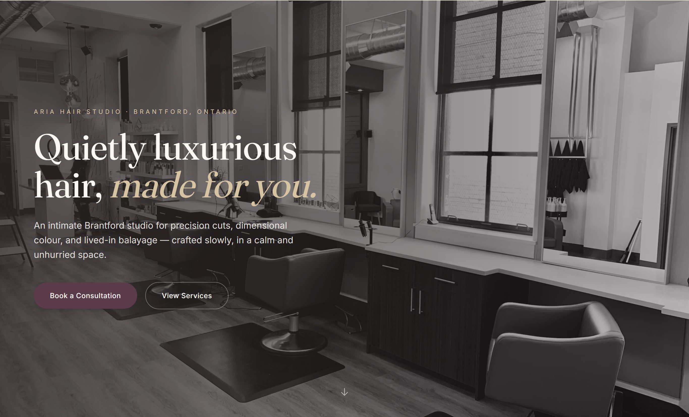
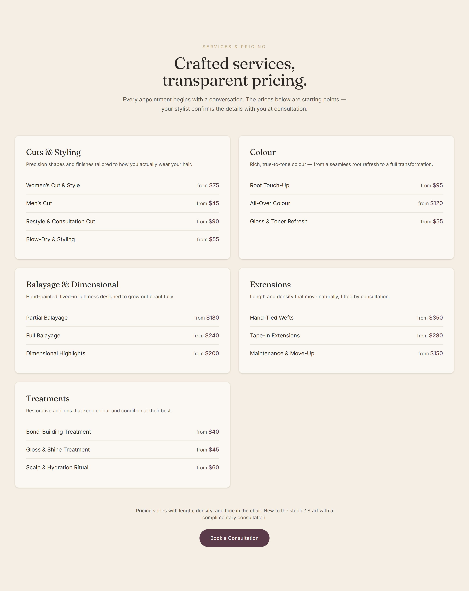
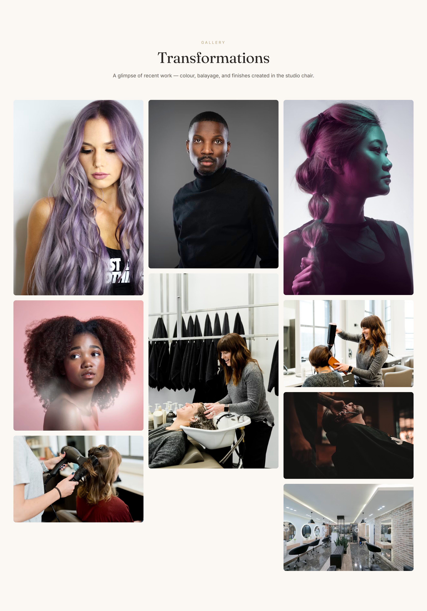
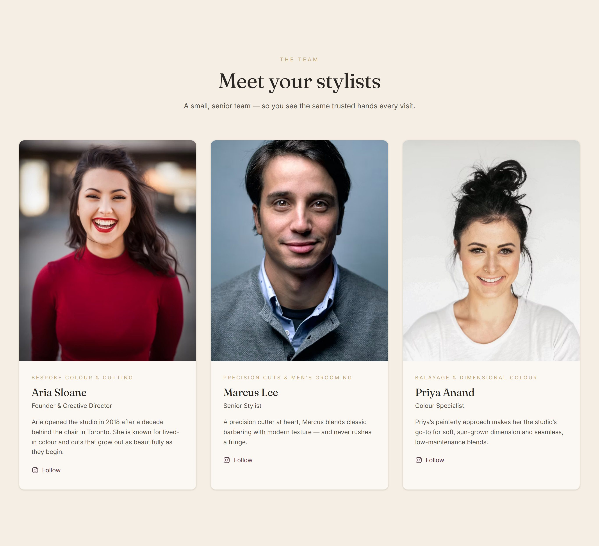
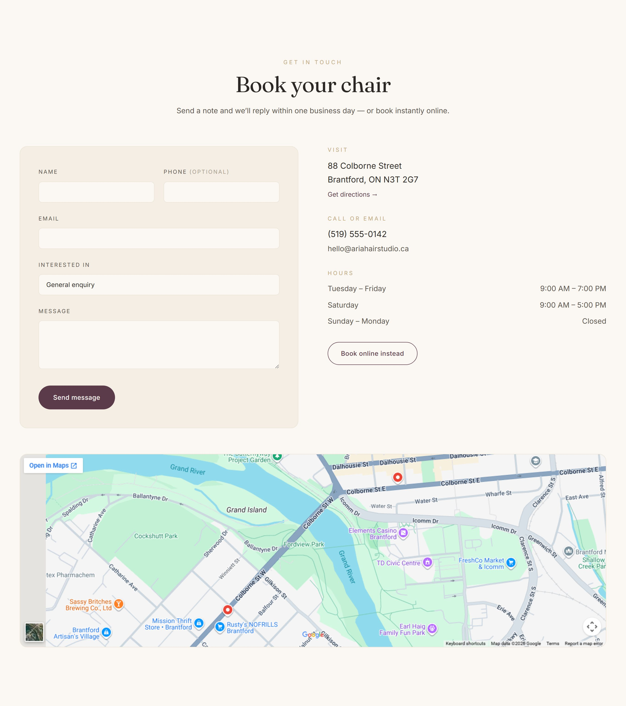
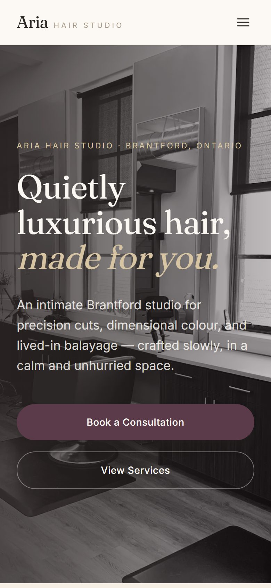

# Aria Hair Studio

A marketing website for **Aria Hair Studio**, a fictional upscale hair salon in Brantford, Ontario. Built from scratch as a portfolio piece: a clean, mobile-first, single-page site with a restrained luxury aesthetic.

> Built with React + Tailwind, using AI-assisted development (Claude Code) with a focus on clean architecture and incremental commits.



---

## Overview

A single-page scrolling site with a sticky anchor navigation and nine sections, each built as its own component:

1. **Navbar** — sticky, responsive (collapses to a hamburger menu), with a booking CTA
2. **Hero** — brand, tagline, and a primary "Book a Consultation" call to action
3. **Services & Pricing** — cut, colour, balayage, extensions, and treatments as a priced menu
4. **Gallery** — a masonry grid of transformations
5. **Stylists** — three stylist bio cards
6. **Testimonials** — client quotes
7. **About** — the salon story with a few quiet highlights
8. **Contact** — a validated (front-end-only) enquiry form, embedded Google Map, click-to-call, hours, and address
9. **Footer** — socials, hours, and copyright

## Tech stack

- **[Vite](https://vite.dev/)** — build tooling and dev server
- **[React 19](https://react.dev/)** — UI, with a small amount of local state (form, mobile menu)
- **[Tailwind CSS v4](https://tailwindcss.com/)** — styling via CSS-first `@theme` design tokens (no `tailwind.config.js`)
- **[Google Fonts](https://fonts.google.com/)** — Fraunces (serif headings) + Inter (sans body)
- **ESLint** — flat config

## Design

- **Palette:** a warm neutral base (ivory, cream, sand, taupe) with warm-charcoal text, one restrained plum/burgundy accent, and a sparing soft-gold detail — all defined as design tokens in [`src/index.css`](src/index.css).
- **Type:** elegant serif headings (Fraunces, with optical sizing) over a clean sans body (Inter), with generous line height and balanced heading wrapping.
- **Motion:** subtle scroll-in reveals and light hover states only — and fully gated behind `prefers-reduced-motion`, so reduced-motion users get a static, fully-visible page.
- **Responsive:** mobile-first throughout, verified across mobile, tablet, and desktop widths.

## Screenshots

| Services & pricing | Gallery |
| --- | --- |
|  |  |

| Stylists | Contact |
| --- | --- |
|  |  |

<p align="center">
  
</p>

## Getting started

**Prerequisites:** Node.js 20.19+ (or 22.12+) and npm.

```bash
# install dependencies
npm install

# start the dev server (http://localhost:5173)
npm run dev

# type-free production build
npm run build

# preview the production build locally
npm run preview

# lint
npm run lint
```

## Project structure

```
src/
├─ components/
│  ├─ layout/        # Navbar, Footer
│  ├─ sections/      # Hero, Services, Gallery, Stylists, Testimonials, About, Contact
│  └─ Reveal.jsx     # reusable scroll-in reveal (reduced-motion safe)
├─ data/             # site config + section content (services, gallery, stylists, testimonials)
├─ App.jsx           # composes the layout + sections
├─ main.jsx          # React entry
└─ index.css         # Tailwind import + design tokens + base styles
```

Content lives in plain data modules under `src/data/`, kept separate from presentation so it's easy to update.

## A note on content

This is a fictional demo. All imagery is from [Unsplash](https://unsplash.com/) as a placeholder for real client and salon photography, and the stylist names, bios, testimonials, address, phone, email, and pricing are illustrative. The "Book Now" / booking buttons link to a placeholder external booking URL (e.g. Fresha/Booksy) — there is no booking backend, and the contact form is front-end only (it validates and shows a success state but does not send anything).

## License

Provided as a portfolio sample. Replace the placeholder content and imagery before any real use.
